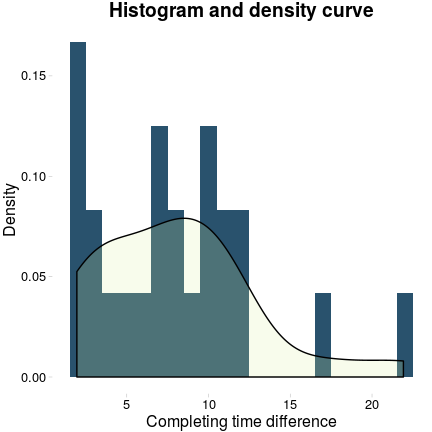
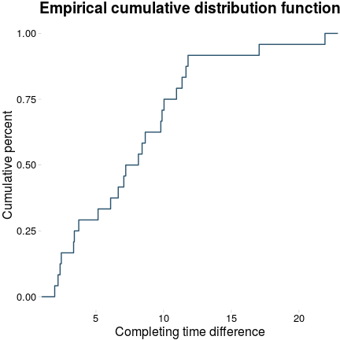

# P1: A statistical analysis of the Stroop effect

This report consists of a brief statistical analysis of a data sample from a Stroop task experiment and a significance study of the Stroop effect. The experiment is based on the following premise:

> In a Stroop task, participants are presented with a list of words, with each word displayed in a color of ink. The participant’s task is to say out loud the color of the ink in which the word is printed. The task has two conditions: a congruent words condition, and an incongruent words condition. In the congruent words condition, the words being displayed are color words whose names match the colors in which they are printed: for example RED, BLUE. In the incongruent words condition, the words displayed are color words whose names do not match the colors in which they are printed: for example PURPLE, ORANGE. In each case, we measure the time it takes to name the ink colors in equally-sized lists. Each participant will go through and record a time from each condition.

The results suggests that there is a statistically significant effect of the congruent/incongruent condition on the time taken to complete the task with a confidence level of \(\alpha = 0.01\). Addtionally, it was found that 73.66% of the variability of the completing time differences could be attributed to the incongruent/congruent condition.

### 1. What is our independent variable? What is our dependent variable?

In this case the independent variable would be the congruent/incongruent condition and the dependent variable is the time the user takes to complete the task.

### 2. What is an appropriate set of hypotheses for this task? What kind of statistical test do you expect to perform? Justify your choices.

Based on the experimental design and the data provided, I set to find out whether there was a statistically significant increase in the time taken to complete the task when the user faced the incongruent condition compared to the congruent condition's case. With that in mind, I decidede to define the mean of the sampling distribution that I was testing for as the difference in the average completing time in each condition (\(\mu_{D} = \mu_{I} - \mu_{C}\)). Correspondingly, the null hypothesis was defined as \(\mu_{D}\) being zero and the alternative as it being positive:

\(H_{0}: \mu_{D} = 0\)

\(H_{A}: \mu_{D} > 0\)

Once the hypothesis were defined, I had to decide on what statistical test I would use to prove which hypothesis was correct. The first obvious step was to define the study as a paired test analisys since I was trying to determine whether the mean of the differences between the time to complete the task for the two conditions differs from zero. Secondly, based on the assumption that the mean of the sampling distribution followed a normal distribution, the two most obvious choices were *z-test* and the *t-test*. Furthermore, in this case the Standard Deviation (SD) of the population was not known and the population size was less than 30 so the *t-test* was picked as the best option among the two.

### 3. Report some descriptive statistics regarding this dataset. Include at least one measure of central tendency and at least one measure of variability.

The next step taken was to obtain some descriptive statistics of the dataset. These statistics were calculated from the observations of time differences between the completion of the task in the incongruent and congruent conditions (\(t_{I} - t_{C}\)).

<table align="center">
  <tr>
    <th>Parameter</th>
    <th>Value</th>
  </tr>
  <tr>
    <td>Mean</td>
    <td>7.96</td>
  </tr>
  <tr>
    <td>Median</td>
    <td>7.67</td>
  </tr>
  <tr>
    <td>St. Dev.</td>
    <td>4.86</td>
  </tr>
  <tr>
    <td>Maximum</td>
    <td>21.92</td>
  </tr>
  <tr>
    <td>Minimum</td>
    <td>1.95</td>
  </tr>
  <tr>
    <td>df</td>
    <td>23</td>
  </tr>
</table>

It is possible to observe that in average the users spent 7.96 more seconds when the colors did not match the words shown (incongruent condition) than in the color-word matching case. The range of this difference went from 1.95 up to 21.92. Also, the standard deviation reported a value of 4.86 seconds.

### 4. Provide one or two visualizations that show the distribution of the sample data. Write one or two sentences noting what you observe about the plot or plots.

In order to study the distribution of the sample data I decided to plot a histogram and its density curve. Both the histogram and the density function show a unimodal right-skewed distribution of the data. Meaning that onlye one peak is observed in the curve and that most of the values are clustered around small completing time differences and very few of the values are located on the right end of the distribution.

Additionally, I plotted the empirical cumulative distribution of the sample data to make more precise observations. In general terms, this graph gives a similar picture to what was seen in the previous figure. Most of the values are located in the low-end of the completing time differences, 50% of the values are located to the left of 7.6665 seconds mark (median), and the by the 12 seconds mark more than 90% of the values are covered.

### 5. Now, perform the statistical test and report your results. What is your confidence level and your critical statistic value? Do you reject the null hypothesis or fail to reject it? Come to a conclusion in terms of the experiment task. Did the results match up with your expectations?

Finally, the *t-test* was performed. The following procedure was used:

1.  Calculate the Standard Error (SE)
2.  Obtain the *t-test* statistic and find the *t-critical* value
3.  Compare the values obtained in step 2 and reject the null hypothesis if the *t-test* statistic is larger than the *t-critical* value

In this case, the null hypothesis was rejected for a confidence level of \(\alpha=0.01\) based on the results obtained:

\(t(23) = 8.02, p < .01, one-tailed\)

That result signifies that there is actually an statistically significant effect of the congruent/incongruent condition on the time taken to complete the task. This conclusion is in line with what I was expecting, based on my own experience taking the test and the exploratory analysis of the data.

Furthermore, I decided to study the size of the effect of the condition on the time to complete the task. For that purpose I used two indicators: Cohen's *d* and the \(r^2\). For the first one, the value obtained was 1.64, which could be interpretet as that the effect on the dependent variable is large (based on Cohen's own discrimination of the effect). The value obtained for the \(r^2\) was of 0.74, meaning that 73.66% of the variability of the completing time differences could be attributed to the incongruent/congruent condition.

### 6. What do you think is responsible for the effects observed? Can you think of an alternative or similar task that would result in a similar effect?

Even though there is still not a final explanation for the Stroop effect, two theories are commonly used to explain it. In the first one, the lag between reading the word and recognizing the color is explained by the speed of processing of both activities, occuring that the latter requires more time. The second theory states states that the brain is forced to use more attention to recognize a color than to read a word, which is why when an individual is faced with a non congruent word-color matching task she would take a longer time to complete it. Other less known theories include the automation of reading theory, bottleneck theory and parallel distributed processing theory.

Among the different variations of the experiment used to measure the stroop effect, I found the following to be easily understandable examples:

-   **Emotional:** It emphasizes the conflict that appears when a person is shown a emotional relevant word. In one version of the emotional stroop task, individuals were shown randomly colored negative emotional words (e.g. "depression," "pain," and "grief") and neutral words (e.g. "clock," "door," and "box"). The individuals were supposed to name the color. It has been found that individuals suffering from depression are more likely to say the color of a negative word slower than the color of a neutral word.

-   **Spatial:** It shows how congruent or incongruent orientation word affects processing of the orientation of visual objects. One experimental design consisted of participants naming the orientation of a rectangle that partially blocked another rectangle. Congruent or incongruent orientation words appeared in different locations. The results suggested that object-based attention plays an important role in processing of irrelevant words.

### References

[Choosing between z-test and t-test](http://stats.stackexchange.com/questions/85804/choosing-between-z-test-and-t-test)

[Sampling Distribution of the Mean](http://onlinestatbook.com/2/sampling_distributions/samp_dist_mean.html)

[Welcome to the Purdue OWL](https://owl.english.purdue.edu/owl/owlprint/672/)

[Histogram Interpretation: Skewed (Non-Normal) Right](http://www.itl.nist.gov/div898/handbook/eda/section3/histogr6.htm)

[Effect Size](http://www.uccs.edu/lbecker/effect-size.html)

[Stroop effect](https://en.wikipedia.org/wiki/Stroop_effect)

[What is the Stroop effect?](http://www.wisegeek.org/what-is-the-stroop-effect.htm)

[A Stroop Effect for Spatial Orientation](http://www.academia.edu/25948431/A_Stroop_Effect_for_Spatial_Orientation)
